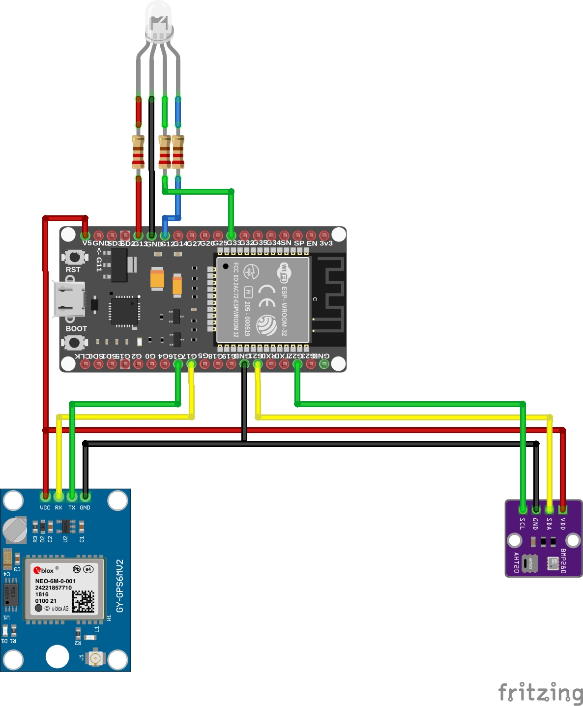

# Estação meteorológica portátil utilzando o módulo AHT20 + BMP280 (Integrado)

### Componentes
---

-- `ESP-32`: O microcontrolador que recebe os dados dos sensores.
- `LED RGB`:
    - `Branco`: Indica que o dispositivo está em processo de inicialização.
    - `Verde`: Indica que a coleta foi finalizada (Somente 1 piscada de 1 segundo).
    - `Azul` Indica que está em processo de coleta.
    - `Vermelho`: Indica que houve um erro no `BMP280` ou falha no `GPS`.
- `Resistores de 220 Ohms`: Para diminuir um pouco a tensão dos `LEDs`, para não correr o risco de queimar os mesmos.
- `AHT20 + BMP280`: Responsável por medir a temperatura, umidade, pressão e altitude do ambiente.
- `GY-NEO6MV2`: Responsável por coletar os dados de geolocalização e velocidade.

### Bibliotecas Utilizadas
---

As bibliotecas de terceiros utilizadas para desenvolver esse projeto estão dentro da pasta `bibliotecas`, sendo elas:

- `Adafruit_BMP280`: Responsável pela coleta de dados barométricos (Pressão e altitude) do módulo `AHT20 + BMP280`.
- `AHTxx`: Responsável pela coleta de temperatura e umidade do módulo `AHT20 + BMP280`.
- `TinyGPSPlus`: Responsável pelo funcionamento do módulo de `GPS`.

As demais bibliotecas utilizadas são bibliotecas disponibilizadas pela instalação padrão do `Arduino IDE` com importação dos pacotes do `ESP-32`.

### Esquemático do Projeto
---

Aqui encontra-se como o projeto foi e como deve ser montado:

### Estrutura das Métricas
---

O sensor `AHT20 + BMP280` efetua a métrica da temperatura em `ºC`, umidade do ar em `Percentual`, altitude em `Metros` e pressão em `Pascal (Pa)`.
O sensor `GY-NEO6MV2` coleta dados de latitude, longitude e velocidade em `km/h`.